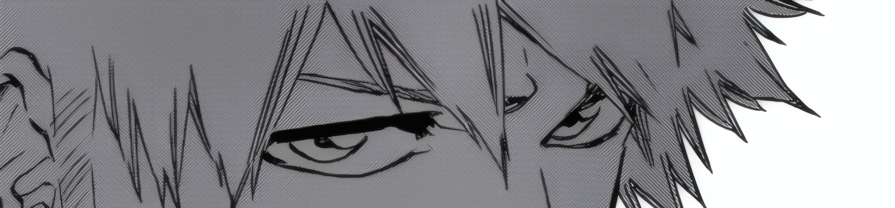
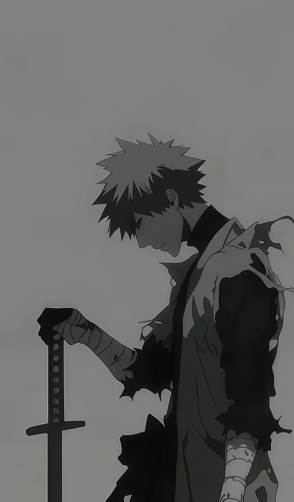
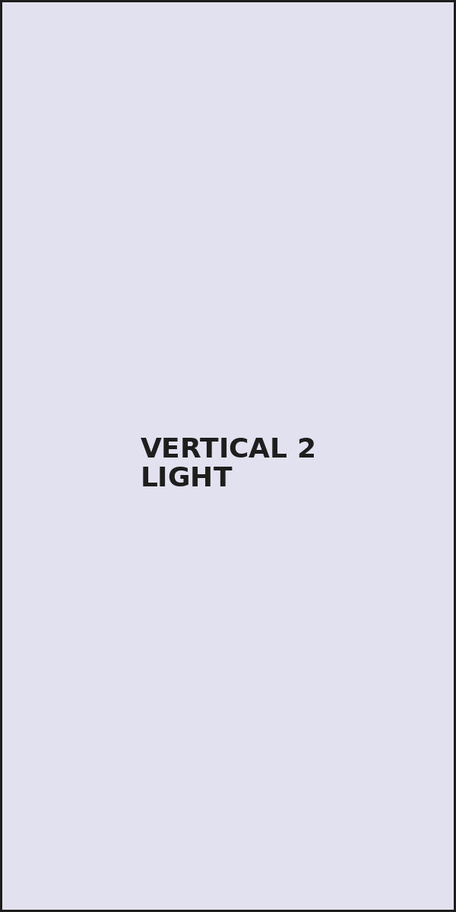

<!-- ============================================= -->
<!-- BANNER HORIZONTAL — arriba de todo             -->
<!-- Necesitás DOS imágenes (o gifs):               -->
<!--   assets/banner-dark.gif  (para modo oscuro)   -->
<!--   assets/banner-light.gif (para modo claro)    -->
<!-- Medida sugerida: 1500x350px                    -->
<!-- ============================================= -->

  <picture>
    <source media="(prefers-color-scheme: dark)" srcset="./assets/banner-dark.gif">
    <source media="(prefers-color-scheme: light)" srcset="./assets/banner-light.gif">
    
  </picture>

<table border="0" cellspacing="0" cellpadding="0" style="border: none;">
<tr>
<td width="60%" valign="top" style="border: none;">

<h1>Lautaro Souza</h1>

Full-Stack Developer · Backend en Go

  <a href="https://www.linkedin.com/in/lautaro-souza-3069a5398">LinkedIn</a> ·
  <a href="mailto:lautarosouza58@gmail.com">Email</a> ·
  <a href="https://github.com/Prominence673">GitHub</a>
  <a href="https://portfoliov2-prominence.netlify.app">Portfolio</a>

 

## Sobre mí

Desarrollador full-stack en **Otter.ly**, una consultora de software donde construimos SaaS, sistemas web y automatizaciones a medida. Actualmente en transición hacia backend, especializándome en **Go** (tambien mejorando activamente en PHP, Python y Node). En frontend programo actualmente utilizando Typescript, React y Tailwind.

Proyectos destacados: **tdocli** (CLI task manager en Go), **Rxemu** (CLI de youtube music), **Portfolio** (Portfolio personal).

 

## Stack

  <picture><source media="(prefers-color-scheme: dark)" srcset="./assets/icons/dark/go.svg"></picture>&nbsp;&nbsp;
  <picture><source media="(prefers-color-scheme: dark)" srcset="./assets/icons/dark/php.svg"></picture>&nbsp;&nbsp;
  <picture><source media="(prefers-color-scheme: dark)" srcset="./assets/icons/dark/react.svg"></picture>&nbsp;&nbsp;
  <picture><source media="(prefers-color-scheme: dark)" srcset="./assets/icons/dark/typescript.svg"></picture>&nbsp;&nbsp;
  <picture><source media="(prefers-color-scheme: dark)" srcset="./assets/icons/dark/nodejs.svg"></picture>&nbsp;&nbsp;
  <picture><source media="(prefers-color-scheme: dark)" srcset="./assets/icons/dark/mysql.svg"></picture>&nbsp;&nbsp;
  <picture><source media="(prefers-color-scheme: dark)" srcset="./assets/icons/dark/docker.svg"></picture>&nbsp;&nbsp;
  <picture><source media="(prefers-color-scheme: dark)" srcset="./assets/icons/dark/git.svg"></picture>

 

## Stats

  <picture>
    <source media="(prefers-color-scheme: dark)" srcset="https://github-readme-stats-theta-two-91.vercel.app/api?username=Prominence673&show_icons=true&hide_border=true&theme=dark&bg_color=00000000&text_color=8b949e&icon_color=8b949e&title_color=c9d1d9&hide_title=true">
    <source media="(prefers-color-scheme: light)" srcset="https://github-readme-stats-theta-two-91.vercel.app/api?username=Prominence673&show_icons=true&hide_border=true&theme=default&bg_color=00000000&text_color=57606a&icon_color=57606a&title_color=24292f&hide_title=true">
    
  </picture>
  <picture>
    <source media="(prefers-color-scheme: dark)" srcset="https://github-readme-stats-theta-two-91.vercel.app/api/top-langs/?username=Prominence673&layout=compact&hide_border=true&theme=dark&bg_color=00000000&text_color=8b949e&title_color=c9d1d9&hide_title=true">
    <source media="(prefers-color-scheme: light)" srcset="https://github-readme-stats-theta-two-91.vercel.app/api/top-langs/?username=Prominence673&layout=compact&hide_border=true&theme=default&bg_color=00000000&text_color=57606a&title_color=24292f&hide_title=true">
    
  </picture>

 

## Proyectos

  <picture>
    <source media="(prefers-color-scheme: dark)" srcset="https://github-readme-stats-theta-two-91.vercel.app/api/pin/?username=Prominence673&repo=tdocli&hide_border=true&theme=dark&bg_color=00000000&text_color=8b949e&title_color=c9d1d9">
    <source media="(prefers-color-scheme: light)" srcset="https://github-readme-stats-theta-two-91.vercel.app/api/pin/?username=Prominence673&repo=tdocli&hide_border=true&theme=default&bg_color=00000000&text_color=57606a&title_color=24292f">
    
  </picture>
  <picture>
    <source media="(prefers-color-scheme: dark)" srcset="https://github-readme-stats-theta-two-91.vercel.app/api/pin/?username=Prominence673&repo=Rxemu&hide_border=true&theme=dark&bg_color=00000000&text_color=8b949e&title_color=c9d1d9">
    <source media="(prefers-color-scheme: light)" srcset="https://github-readme-stats-theta-two-91.vercel.app/api/pin/?username=Prominence673&repo=Rxemu&hide_border=true&theme=default&bg_color=00000000&text_color=57606a&title_color=24292f">
    
  </picture>
    <picture>
    <source media="(prefers-color-scheme: dark)" srcset="https://github-readme-stats-theta-two-91.vercel.app/api/pin/?username=Prominence673&repo=Portfolio-v2&hide_border=true&theme=dark&bg_color=00000000&text_color=8b949e&title_color=c9d1d9">
    <source media="(prefers-color-scheme: light)" srcset="https://github-readme-stats-theta-two-91.vercel.app/api/pin/?username=Prominence673&repo=Portfolio-v2&hide_border=true&theme=default&bg_color=00000000&text_color=57606a&title_color=24292f">
    
  </picture>

 

Buenos Aires, Argentina

</td>
<td width="40%" valign="top" style="border: none;">

<!-- ============================================= -->
<!-- BANNER LATERAL — dividido en 2 imágenes        -->
<!-- Necesitás CUATRO imágenes (o gifs):            -->
<!--   assets/banner-vertical-1-dark.png/gif        -->
<!--   assets/banner-vertical-1-light.png/gif       -->
<!--   assets/banner-vertical-2-dark.png/gif        -->
<!--   assets/banner-vertical-2-light.png/gif       -->
<!-- Ancho de referencia sugerido: 800px            -->
<!-- GitHub no respeta height:100% acá, así que usamos -->
<!-- un alto FIJO en px (generoso) + object-fit:cover -->
<!-- para que cubra de sobra el contenido real.      -->
<!-- Si te sobra imagen abajo, no se nota (se recorta). -->
<!-- Si te falta, agrandá el valor de height abajo.  -->
<!-- ============================================= -->
<picture>
  <source media="(prefers-color-scheme: dark)" srcset="./assets/banner-vertical-1-dark.png">
  <source media="(prefers-color-scheme: light)" srcset="./assets/banner-vertical-1-light.png">
  
</picture>

<picture>
  <source media="(prefers-color-scheme: dark)" srcset="./assets/banner-vertical-2-dark.png">
  <source media="(prefers-color-scheme: light)" srcset="./assets/banner-vertical-2-light.png">
  
</picture>

</td>
</tr>
</table>
